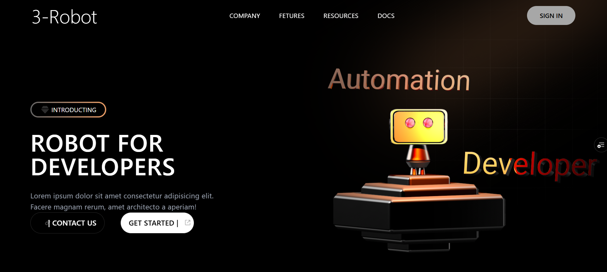

# 🤖 Robot Developer - 3D Landing Page

An interactive 3D landing page showcasing frontend development skills, built with **React.js**, **Spline**, and **Tailwind CSS**. Designed to impress with sleek animations, responsive layout, and a realistic 3D model — this project is a modern frontend experiment inspired by **MiladiCode**'s YouTube tutorial.

## 🚀 Live Demo

👉 [Visit the Live Site](https://3d-landing-page-wine.vercel.app/)

## 🔧 Tech Stack

- **Framework**: React.js
- **3D Rendering**: Spline
- **Animations**: AOS (Animate On Scroll)
- **Styling**: Tailwind CSS
- **Build Tool**: Vite
- **Package Manager**: NPM

## 🎯 Purpose

This project was developed to demonstrate my skills in modern frontend development using cutting-edge tools and design practices, with a focus on 3D web experiences.

## ✨ Features

- 🧠 **Interactive 3D Model** using Spline
- ✨ **Smooth Scroll Animations** powered by AOS
- 📱 **Fully Responsive Design** for all screen sizes
- ⚡ **Optimized for Performance** with Vite

## 📸 Screenshots

<!-- Attach your screenshots below -->

> _Place your images inside a `screenshots/` folder in the root directory._

## 🧑‍💻 Author

Developed by **Mohammad Tahzeeb Khan**, inspired by a tutorial from [MiladiCode YouTube Channel](https://www.youtube.com/@MiladiCode).

## 📄 License

This project is for educational and portfolio purposes only.
